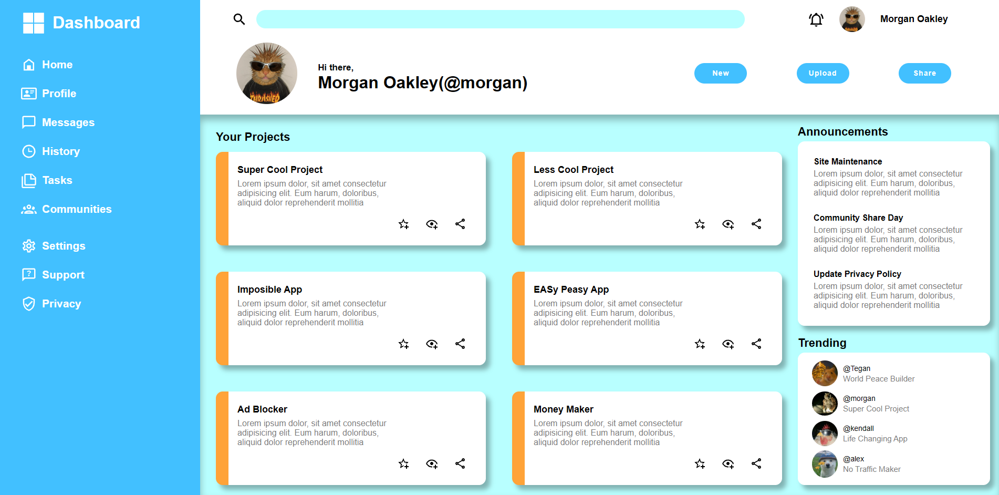

# Admin Dashboard

## 📋 ภาพรวมโปรเจค

โปรเจคนี้เป็นแอดมินแดชบอร์ดที่สร้างขึ้นโดยใช้ **HTML และ CSS บริสุทธิ์** โดยไม่มีการใช้ Framework ใดๆ เพื่อให้สามารถเข้าใจพื้นฐานของการสร้าง UI ได้อย่างลึกซึ้ง

---

## 🎯 จุดประสงค์ของโปรเจค

โปรเจคนี้ถูกสร้างขึ้นเพื่อ **ฝึกฝนความสามารถในการใช้ HTML และ CSS** ก่อนเดินหน้าไปใช้ Frontend Framework ต่างๆ (เช่น React, Vue.js)

ด้วยการสร้างโปรเจคแบบนี้ ฉันเข้าใจ:
- ✅ โครงสร้าง HTML และความหมายของแต่ละ Element
- ✅ หลักการทำงาน CSS Layout (Flexbox, Grid, Positioning)
- ✅ การจัดการ Responsive Design ทั่วไป
- ✅ Best Practice ในการสร้าง UI ที่สวยงามและใช้งานได้

เมื่อมีพื้นฐานที่มั่นคง ฉันจะสามารถใช้ Framework ได้อย่างมีประสิทธิภาพและเข้าใจปัญหาได้ลึกขึ้น

---

## 📚 สิ่งที่ฉันเรียนรู้จากโปรเจคนี้

1. **ตรวจสอบการเชื่อมต่อไฟล์ HTML และ CSS ก่อนเริ่มงาน** - เป็นขั้นตอนสำคัญที่จะช่วยประหยัดเวลาในการแก้บัค

2. **การใช้ Box Shadow และ Inset** - เมื่อ Element หนึ่งถูก Cover โดย Element อื่น ข้างต้าน `inset` จะช่วยให้ Shadow ทำงานได้ถูกต้อง

3. **วิธีการ Commit อย่างมีประสิทธิภาพ** - การ Commit บ่อยและทำทีละอย่างเดียว ช่วยให้ Commit Message ชัดเจนและ History อ่านง่าย

4. **การเลือกสีข้อความและพื้นหลัง** - ข้อความสีขาว (White text) ทำงานได้ดีกว่าบนพื้นหลังสีเข้ม

5. **ความสำคัญของไอคอน** - ไอคอนมีผลกระทบอย่างมากต่อ Look & Feel ของเว็บไซต์

---

## 👤 เกี่ยวกับฉัน

ฉันคือ Developer ที่เชื่อในความสำคัญของพื้นฐาน ก่อนจะลงลึกลงไปในเทคโนโลยีที่ซับซ้อน ฉันมุ่งเน้นที่การสร้าง User Interface ที่มีคุณภาพดี และเข้าใจหลักการทำงานของเครื่องมือที่ใช้

**สิ่งที่ฉันให้ความสำคัญ:**
- 📌 ความเข้าใจลึก ไม่ใช่แค่ Copy-Paste Code
- 📌 Clean Code และ Best Practice
- 📌 Continuous Learning และการปรับปรุงตัวเอง
- 📌 Attention to Detail ในการออกแบบ UI/UX

---

## 🛠️ เทคโนโลยีที่ใช้

- HTML5
- CSS3

---

## 📝 หมายเหตุ

โปรเจคนี้เป็นส่วนหนึ่งของการเรียนรู้และพัฒนาทักษะ หากคุณมีคำแนะนำหรือข้อเสนอแนะ ฉันยินดีรับฟังและนำไปปรับปรุง
